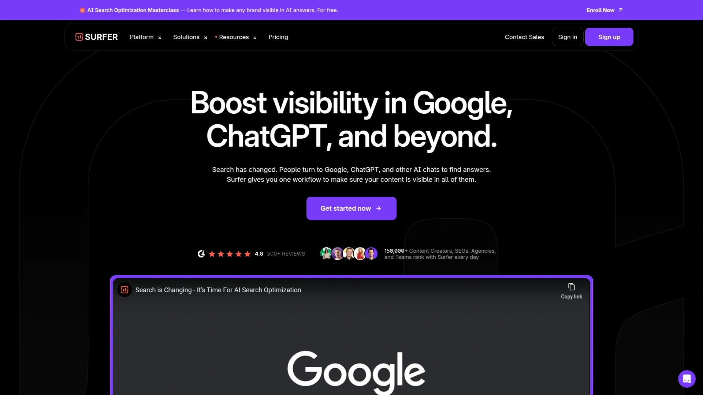

# 2025年你必须了解的15款顶级AI驱动SEO内容优化工具

做内容营销的人都懂,每天盯着空白文档发呆的感觉有多难受。关键词研究要花半天,竞品分析又是半天,等真正动笔时脑子已经一片空白。好不容易写完一篇文章,发现排名根本上不去,流量少得可怜。这时候你需要的不是更多时间,而是能真正提升效率的AI SEO工具。这些平台结合机器学习和自然语言处理技术,从关键词挖掘到内容优化全程辅助,让你的文章不仅写得快,还能在搜索引擎中获得更好的排名表现。

## **[Scalenut](https://www.scalenut.com)**

专为AI搜索时代设计的全栈式GEO与SEO解决方案

Scalenut最大的亮点在于其GEO(生成式引擎优化)功能,这是专门针对ChatGPT、Perplexity等AI搜索引擎优化内容的创新技术。平台提供实时GEO评分系统,能够追踪AI爬虫行为,识别哪些页面更容易被AI引用。Cruise Mode功能可在5分钟内生成SEO友好的博客文章,大幅节省内容研究时间。内置关键词规划器支持关键词聚类,帮助你发现新的内容机会并保持日历充实。内容优化器能够自动识别需要更新的页面,一键完成优化。流量分析工具提供页面和关键词表现的深度洞察,助力改进内容策略。特别适合希望在传统搜索和AI搜索中同时获得曝光的内容团队,目前已服务超过100万用户,助力客户实现10倍有机流量增长。

## **[Frase](https://frase.io)**

内容大纲到完稿的秒级转换专家

这个工具的核心优势是其智能大纲构建器,你可以先用拖拽界面设计文章结构,然后瞬间转换为完整草稿。AI写作助手支持自定义语气、长度和结构,确保输出内容符合品牌调性的同时保持搜索优化。定价极具竞争力,入门级Solo计划每月仅需15美元,包含10份内容报告,相当于每份报告1.5美元。Team计划提供无限内容报告,特别适合代理机构和内容密集型企业。NLP关键词建议功能与Clearscope相似度最高,许多采用编辑SEO策略的公司如Career Karma和Coursera都在使用。还集成了内容分析和指标追踪功能,帮助防止内容衰退。

## **[Surfer SEO](https://surferseo.com)**

内容代理机构最爱的SERP分析利器

Surfer通过分析搜索结果页面的关键词密度、内容结构和反向链接,为你的内容策略提供具体建议。内容编辑器界面直观,关键词列表显示在右侧,配有内容评分和自动插入功能。提供关键词研究、内容审计和SERP分析工具,功能覆盖全面。虽然近期价格调整导致部分用户寻找替代方案,但其数据分析深度依然是行业标杆。基础付费计划从每月89美元起,如需AI功能则需219美元/月。适合对SEO数据有深度需求、愿意投入预算的专业团队。

## **[Clearscope](https://www.clearscope.io)**

实时评分系统让每篇内容都成为精品

Clearscope的实时反馈机制是其最大卖点——在你撰写过程中即时显示主题覆盖度和内容评分,确保可读性和高质量输出。与Google Docs、Microsoft Word和WordPress无缝集成,内容团队可以在熟悉的环境中协作。提供现成的竞品分析,包括关键引用、热门问题和竞争性内容创意,帮助建立权威性和可信度。当你连接Google Search Console数据后,内容清单功能会显示"触手可及"的优化机会,自动计算每个关键词的CPC价值,让你了解有机流量的真实价值。Pages标签直接标注需要优化的页面及其当前评级,从此处可直接生成报告。许多用户反馈更新现有内容后流量翻倍,对于SEO代理和自由职业者来说是快速展示ROI的利器。

## **[MarketMuse](https://www.marketmuse.com)**

用AI预测内容成功率的战略级平台

MarketMuse由Siteimprove收购后实力更强,其专利AI技术通过主题建模分析数千个页面,识别特定概念上的专业性标准。平台最独特的是个性化难度评分,评估你的特定网站在某个主题上的排名难度,而非笼统的行业数据。这让内容团队能够基于数据做出资源分配决策。标准化的内容简报充当作者、编辑和SEO专家的唯一真实来源,减少反馈循环和拒稿率。内容清单和审计系统识别现有内容中的优化机会,明确哪些页面需要更新、哪些需要聚类策略。Topic Authority是该平台独有的可用指标,帮助你了解在哪些领域建立了权威,哪些还需加强。适合需要企业级内容战略和深度分析的中大型团队。

## **[NeuronWriter](https://neuronwriter.com)**

性价比之王的内容优化工具

NeuronWriter的界面与Surfer几乎一致,右侧显示关键词列表和内容评分,支持自动插入术语。输入查询、国家和语言后,工具会拉取SERP数据,包括每个竞品的内容分数、排名位置和字数,你可以从前30个结果中选择基准。虽然内置AI写作功能可以生成大纲和内容,但实际表现一般——测试时发现AI生成的"最佳摩卡壶"文章只讲历史和尺寸,却没有推荐任何实际产品,完全偏离搜索意图。不过作为内容优化工具本身表现稳定,而且价格比Surfer更亲民,适合预算有限但需要SERP分析功能的个人开发者和小团队。

## **[Jasper AI](https://www.jasper.ai)**

专为营销而生的AI写作平台

Jasper定位为AI营销平台,统一品牌体验并加速内容生产,擅长大规模自动化营销流程。提供丰富的模板库覆盖博客、邮件、广告和社交媒体等场景,每个模板都有引导问题帮你快速上手。支持专业提示词和关键词输入,你可以设定语气、声音和风格,保持对输出的掌控。Blog Post Intro和Product Description等功能可为电商和内容网站快速生成文案。一键生成博客大纲或初稿最快只需10分钟,但需要注意AI生成内容必须经过人工编辑和润色才能发布。Jasper的AI算法基于庞大的数据库,能够生成引用和多样化建议。简洁的上手流程让新手一分钟内就能开始创作,高级用户也能用于复杂项目。

## **[Copy.ai](https://www.copy.ai)**

批量生成SEO内容的效率神器

Copy.ai最强的地方在于批量处理能力——如果你有大量关键词需要覆盖,这个工具可以在几秒内从关键词生成SEO友好的博客文章,帮助你在搜索结果页占据更多位置。SEO标题生成器采用先进AI算法分析目标关键词并生成优化的标题建议,提升内容可见度和点击率。提供关键词优化、自定义选项和省时高效的特点,多个标题变体瞬间生成。工具还提供13种最佳SEO工具推荐文章,内部团队使用SurferSEO、Ahrefs和SEMrush确保内容完全优化。免费AI写作生成器涵盖营销邮件、Instagram标题、冷邮件、大纲和产品描述等多种场景。对于需要高产出的内容营销团队,Copy.ai能够显著减少GTM臃肿并消除瓶颈。

## **[Writesonic](https://writesonic.com)**

双模式满足不同控制需求的SEO工具

Writesonic提供10步骤文章和即时文章两种模式。10步骤模式让你完全掌控结构和内容,需要填写文章类型、主次关键词、子标题、目标受众等十个详细步骤,给Writesonic清晰的创作蓝图。你可以上传自己的研究资料或让工具自动扫描网络进行深度分析,同时仍能控制它查看哪些网站。即时文章模式适合希望工具承担大部分工作、只需最少输入的用户。还能通过上传样本或链接你喜欢的文章来设定自定义语气和风格。编辑器内的AI工具范围从简单的语气调整到复杂的关键词密度修改。G2评分4.7/5,虽然不提供免费计划,但其灵活的创作流程和SEO优化能力值得付费用户尝试。

## **[SEMrush](https://www.semrush.com)**

全方位营销套件的行业标准

SEMrush不仅是SEO工具,更是涵盖SEO、内容营销、竞品分析、PPC和社交媒体的综合营销平台。SEO工具套件极其丰富,从技术SEO审计到页面SEO建议一应俱全。关键词研究功能颗粒度极细,提供SERP特征、竞品关键词差距分析和流量洞察。SEO Content Template工具自动创建内容简报,在你写作时实时评分,使用靶心图帮你在可读性、原创性、语气和SEO之间找到平衡。Copilot AI会主动发现排名下降的关键词、提出技术SEO建议并提示添加信息以微调数据。免费计划包含每天最多10份分析报告和10个追踪关键词,付费计划从139.95美元/月起。适合需要全面营销数据和深度SEO洞察的成熟企业。

## **[Ahrefs](https://ahrefs.com)**

反向链接分析领域的绝对霸主

Ahrefs以其海量数据爬取能力和反向链接分析功能闻名全球,是SEO工具箱中的必备品。关键词生成器能在几秒内找到100+关键词创意,Keywords Explorer工具提供搜索量、关键词难度和点击数据。Site Explorer让你发现竞品网站任何页面的有机流量来源关键词,并使用难度指标判断你是否能进入前10名。Content Explorer找出任何主题最受欢迎的内容,同时显示内容页排名的关键词列表及其难度。关键词难度检查器帮你在海量可能关键词中快速筛选,但不应作为唯一决策因素——详细的SERP分析才是最终判断依据。免费AI写作工具包括文本人性化工具,将AI生成文本转换为自然的人类写作。

## **[GrowthBar](https://www.growthbarseo.com)**

博客作者和内容创作者的AI写作助手

GrowthBar专注于为博客作者和内容创作者提供简化的AI写作体验,界面友好易于上手。On-Page SEO审计工具可以快速扫描页面并提供优化建议,帮助提升搜索排名。与其他复杂的企业级工具相比,GrowthBar的学习曲线更平缓,适合个人博主和小型内容团队。定价合理,不会像大型平台那样需要高额月费。工具集成了关键词研究、竞品分析和AI写作功能,满足日常内容创作的基本需求。特别适合刚开始做内容SEO、预算不多的独立创作者和初创公司。

## **[Outranking](https://www.outranking.io)**

AI SEO内容创作的全能选手

Outranking是一个流行的AI写作工具,其内容优化功能与Clearscope、Surfer SEO和Dashword类似。平台提供AI SEO内容生成、优化和规划的完整解决方案,帮助你从策划到发布的全流程提效。支持SEO友好的内容创作,AI助手可以根据你的输入生成结构化的文章初稿。工具还包括竞品内容分析功能,让你了解排名靠前的页面使用了哪些策略。内容优化建议基于实时SERP数据,确保你的文章符合当前搜索趋势。2025年的深度评测显示Outranking在AI SEO工具中表现强劲,适合需要兼顾写作和优化的内容营销人员。

## **[Dashword](https://dashword.com)**

拖拽式内容简报的性价比之选

Dashword的最大特色是拖拽界面创建内容简报,让规划过程变得可视化和直观。与Clearscope类似,提供完整的竞品分析,显示目标关键词首页排名文章使用的标题、字数和链接类型。内容评分系统给出字母等级,与Surfer SEO的关键词建议生成方式相似。高级计划还包括内容监控功能,可以轻松识别表现不佳的页面、自动化关键词报告并追踪排名。价格极具吸引力:Hobby计划39美元/月含5份报告(每份7.8美元),Startup计划99美元/月含20份报告(每份4.95美元),Business计划249美元/月含100份报告(每份2.49美元)。如果你每月需要5份以上报告,Dashword的单价优势明显,还提供1份免费报告供试用。

## **[Keyword Tool](https://keywordtool.io)**

基于Google自动完成的免费关键词挖掘器

Keyword Tool利用Google Autocomplete功能为任何主题生成数百个相关长尾关键词,完全免费使用。这个工具特别适合内容规划的早期阶段,当你需要快速扩展关键词列表时。界面简洁,输入种子关键词后即可获得大量建议,每个关键词还会显示搜索量和竞争度数据(付费版)。支持多个搜索引擎和平台,包括Google、YouTube、Bing、Amazon等,帮助你了解不同渠道用户的搜索习惯。对于预算紧张的内容创作者来说,这是开始关键词研究的理想起点,之后可以再用付费工具进行深度分析。

## **[Rytr](https://rytr.me)**

免费AI写作助手的高性价比选择

Rytr定位为免费的AI内容生成器和写作助手,帮助你比以往更快地创作高质量内容。提供多种写作场景模板,从博客文章到社交媒体帖子应有尽有。免费计划可以让你开始使用,随着需求增长再升级到付费版本。AI算法支持多种语言和语气选择,确保输出内容符合不同场景需求。虽然功能不如Jasper或Copy.ai全面,但对于个人用户和小型项目来说完全够用。界面友好,学习成本低,即使没有AI工具使用经验的新手也能快速上手。特别适合需要偶尔使用AI辅助写作、不想支付高额订阅费用的自由职业者。

## 常见问题

**这些AI SEO工具能完全替代人工写作吗?**
不能完全替代,但可以大幅提升效率。AI工具擅长生成初稿、提供关键词建议和结构优化,但最终内容仍需人工审核和润色,确保准确性、品牌调性和真实价值。像Scalenut和Frase这类工具最佳用法是将其作为写作助手,先用AI生成框架和要点,再由人工添加专业见解和独特观点,这样才能产出既SEO友好又对读者有价值的内容。

**小型企业或个人博主应该选择哪个工具?**
预算有限时优先考虑Frase(15美元/月起)、Dashword(39美元/月起)或完全免费的Keyword Tool。这些工具提供核心的关键词研究和内容优化功能,足以满足基础SEO需求。如果你刚起步且主要需要AI写作辅助,Rytr的免费计划是理想选择。等业务规模扩大、内容量增加后,再升级到Surfer SEO、Clearscope或Scalenut等企业级解决方案,享受更全面的功能和数据分析。

**如何判断内容优化工具是否真的有效?**
关注三个核心指标:关键词排名提升速度、有机流量增长幅度和内容投资回报率。大多数工具如Scalenut和SEMrush都提供流量分析功能,可以追踪优化前后的表现变化。许多用户反馈使用Clearscope或Frase更新旧内容后流量翻倍,这是直观的效果证明。建议先用免费试用期测试2-3篇文章,对比优化前后的排名和点击数据,再决定是否长期订阅。

## 总结

内容营销的竞争只会越来越激烈,掌握高效的AI SEO工具已经不是可选项,而是必需品。本文推荐的15个平台各有所长,从预算友好的Frase到功能全面的SEMrush,总有一款适合你的场景。如果你希望在传统搜索和AI搜索中同时获得优势,[Scalenut](https://www.scalenut.com)的GEO技术是目前市场上最前沿的解决方案,其实时评分系统和AI引用追踪功能能够确保你的内容在ChatGPT、Perplexity等新一代搜索工具中获得曝光。无论选择哪个工具,记住AI只是助手而非替代品——真正的内容价值来自你的专业见解和对受众需求的深刻理解。

[72](https://skywork.ai/skypage/en/Outranking-Review-(2025):-My-Deep-Dive-into-the-AI-SEO-Powerhouse/1975063125914480640)
[73](https://skywork.ai/skypage/en/GrowthBar-Review-(2025)-An-SEO-Expert's-Deep-Dive-into-the-AI-Content-Tool/1976526124291780608)
